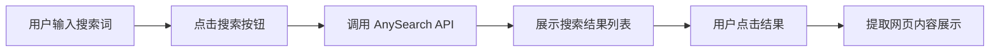

## 1. Product Overview
基于 AnySearch API 的实时搜索应用，为用户提供智能搜索界面和结果展示功能。
- 核心目标：接入 AnySearch API，实现自然语言搜索和结构化结果展示
- 目标用户：需要进行信息检索的开发者和普通用户

## 2. Core Features

### 2.1 User Roles
| Role | Registration Method | Core Permissions |
|------|---------------------|------------------|
| User | 无需注册 | 使用搜索功能 |

### 2.2 Feature Module
1. **搜索界面**: 搜索输入框、搜索按钮、搜索历史、热门搜索
2. **结果展示界面**: 搜索结果列表、内容预览、来源链接

### 2.3 Page Details
| Page Name | Module Name | Feature description |
|-----------|-------------|---------------------|
| 搜索主页 | 搜索输入区 | 支持自然语言查询，回车或点击按钮触发搜索 |
| 搜索主页 | 搜索历史 | 显示最近搜索记录，支持快速重新搜索 |
| 搜索主页 | 热门搜索 | 展示热门搜索词，支持点击搜索 |
| 结果页面 | 结果列表 | 展示搜索结果，包含标题、摘要、来源 |
| 结果页面 | 分页导航 | 支持多页结果浏览 |

## 3. Core Process
用户在搜索框输入查询 → 点击搜索按钮 → 调用 AnySearch API → 展示搜索结果 → 用户可点击查看详情

## 4. User Interface Design

### 4.1 Design Style
- 主色调：深蓝紫色系 (#1e1b4b)，搭配明亮青色 (#06b6d4) 作为强调色
- 按钮风格：圆润圆角，渐变背景，悬停发光效果
- 字体：JetBrains Mono (代码感) + Inter (正文)
- 布局：简洁卡片式，左侧搜索区，右侧结果区
- 图标风格：线性图标，现代化

### 4.2 Page Design Overview
| Page Name | Module Name | UI Elements |
|-----------|-------------|-------------|
| 搜索主页 | 搜索输入区 | 大尺寸搜索框，圆角设计，背景渐变，搜索按钮带动画 |
| 搜索主页 | 搜索历史 | 水平滚动标签，带删除按钮 |
| 结果页面 | 结果列表 | 卡片式布局，标题加粗，摘要灰色，来源链接蓝色 |
| 结果页面 | 加载状态 | 骨架屏动画，渐变占位 |

### 4.3 Responsiveness
- Desktop-first 设计
- 移动端自适应：搜索框全屏宽度，结果卡片堆叠

### 4.4 3D Scene Guidance
- 不适用