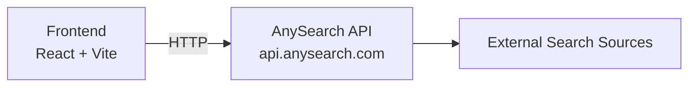
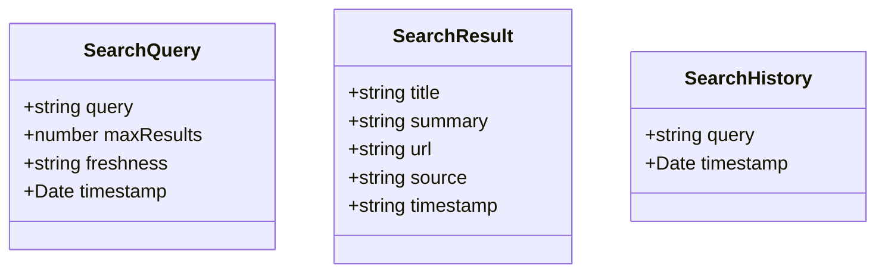

## 1. Architecture Design



## 2. Technology Description
- Frontend: React@18 + TypeScript + TailwindCSS@3 + Vite
- Backend: None (直接调用 AnySearch API)
- API: AnySearch REST API (https://api.anysearch.com/mcp)
- State Management: Zustand

## 3. Route Definitions
| Route | Purpose |
|-------|---------|
| / | 搜索主页，包含搜索输入和结果展示 |

## 4. API Definitions

### AnySearch API
**搜索接口**
- URL: POST https://api.anysearch.com/mcp
- Headers: 
  - Authorization: Bearer {API_KEY}
  - Content-Type: application/json
- Body:
```typescript
{
  "query": string,
  "max_results": number,
  "freshness": "day" | "week" | "month" | "year"
}
```
- Response:
```typescript
{
  "results": Array<{
    "title": string,
    "summary": string,
    "url": string,
    "source": string,
    "timestamp": string
  }>,
  "total": number
}
```

**提取网页内容接口**
- URL: POST https://api.anysearch.com/mcp
- Body:
```typescript
{
  "url": string
}
```

## 5. Server Architecture Diagram
- 不适用（无后端）

## 6. Data Model

### 6.1 Data Model Definition


### 6.2 Data Definition Language
- 不适用（无数据库）